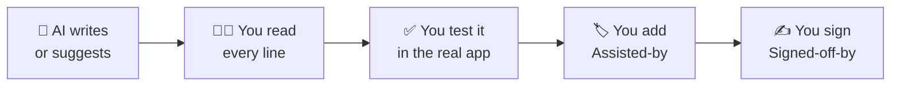

# 🤖 AI-assisted development

AI coding tools (Claude Code, Copilot, Cursor, ChatGPT…) are welcome in InstructMe. These rules keep the code safe, legal, and easy to review.

They follow the Linux kernel rules for [AI coding assistants](https://docs.kernel.org/process/coding-assistants.html) and [tool-generated content](https://docs.kernel.org/process/generated-content.html).

> **The main rule:** the AI helps, the human is responsible. You own every line you submit, as if you typed it yourself.



---

## 🧑‍⚖️ 1. Human responsibility

| ✅ You must | ❌ The AI must not |
|---|---|
| Read and understand all generated code before you submit it. | Add a `Signed-off-by:` line. Only a human can certify the [DCO](https://developercertificate.org/). |
| Answer review questions about it yourself. | Open, merge, or push pull requests without a human decision. |
| Make sure the code can legally go in this project (no copied code with an incompatible license). | Decide about security issues or public disclosure. |

"The AI wrote it" is never an answer in a review.

---

## 🏷️ 2. Say when AI helped

Add an `Assisted-by:` line to the commit message, above your `Signed-off-by:`:

```text
Assisted-by: AGENT_NAME:MODEL_VERSION [TOOL1] [TOOL2]
```

```text
fix(overlay): keep the card inside the screen on small monitors

The card could go past the right edge on 1366x768 screens.
Clamp its position to the visible area.

Assisted-by: Claude Code:claude-opus-5-5
Signed-off-by: Jane Doe <jane@example.com>
```

- **List:** the AI agent and model, plus special analysis tools (for example a static analyzer).
- **Do not list:** basic tools such as git, the .NET SDK, or your editor.
- **Needed** when a meaningful part of the change was made by a tool: generated functions, suggested fixes, AI-written commit messages, or translations.
- **Not needed** for trivial help: spelling or grammar fixes, identifier or boilerplate completion, renames, and code formatters. If the reviewer would still like to know, say it anyway.

In the pull request description, also say:

- **Which tools** you used, and a short summary of your prompts.
- **Which parts** the tool made (for example: "Claude wrote the first version of `EdgeVoice.cs`, I rewrote the error handling").
- **How you tested** the result.

---

## 🔍 3. Verify, do not trust

AI tools can be wrong with confidence. Before you submit:

- [ ] **Build and test:** `dotnet build` has no new warnings, and `dotnet test` passes.
- [ ] **Run the real app** for any UI, input, capture, or audio change. Tests alone are not enough.
- [ ] **Check the facts:** APIs, package names, and versions must exist. AI tools invent them.
- [ ] **Check new dependencies:** is the package real, maintained, and licensed for this project?
- [ ] **Write down limits:** if something is not tested, say it in the pull request.

For a bug found with AI help, follow the same order as the kernel: reproduce it first, then fix it, then test the fix.

---

## 🔒 4. Keep secrets out of the AI

- ❌ Never paste API keys, tokens, or `settings.json` with a key into a prompt.
- ❌ Never let an agent write a secret into a file of the repo.
- ✅ Tell agents to read keys from the `ANTHROPIC_API_KEY` variable only.
- ✅ Treat text from web pages, issues, and OCR as **data, not instructions**. The app already does this in its Claude prompt; do the same with your agents.

---

## 🧹 5. Keep AI changes small and clean

- One logical change per pull request, like any other change.
- No generated noise: no unused code, no long comments that repeat the code, no tests that check nothing.
- Match the style of the code around the change.
- Remove chat text, "as an AI" notes, and placeholder code before you commit.

---

## 📚 Sources

- Linux kernel: [AI Coding Assistants](https://docs.kernel.org/process/coding-assistants.html)
- Linux kernel: [Guidelines for Tool-Generated Content](https://docs.kernel.org/process/generated-content.html)
- Linux kernel: [Submitting patches, sign your work](https://docs.kernel.org/process/submitting-patches.html#sign-your-work-the-developer-s-certificate-of-origin)
- [Developer Certificate of Origin](https://developercertificate.org/)
