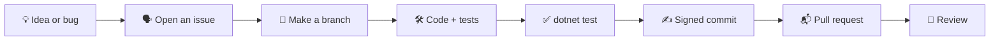

# 🤝 Contributing to InstructMe

Thank you for your help! This page tells you how to go from an idea to a merged pull request.



---

## 🧰 1. Set up

**You need:** Windows 10 (2004+) or 11, the [.NET 10 SDK](https://dotnet.microsoft.com/download), and a [Claude API key](https://console.anthropic.com/) to test definitions.

```bash
git clone <your-fork-url>
cd InstructMe
dotnet build
dotnet test
```

> 🔑 **Never commit your API key.** Put it in the `ANTHROPIC_API_KEY` variable. The app keeps other settings in `%APPDATA%\InstructMe\settings.json`, outside the repo.

For the video in `showreel/`, see [showreel/README.md](showreel/README.md).

---

## 🗣️ 2. Talk first for big changes

| Change size | What to do |
|---|---|
| 🐛 Small fix, typo, docs | Open a pull request directly. |
| ✨ New feature, new dependency, big refactor | Open an issue first. Agree on the idea before you write code. |
| 🔒 Security problem | Do **not** open a public issue. Contact the maintainer privately. |

---

## 🛠️ 3. Write the change

- ✅ **One logical change per pull request.** Do not mix a fix, a refactor, and a feature.
- ✅ **Match the code around you:** names, comments, and style.
- ✅ **Test what the user sees.** Add a test in `tests/InstructMe.Tests/` when you change logic (text layout, input, placement, speech).
- ✅ **Check the real app** for UI changes. Open the overlay (`Ctrl+Alt+L`) and add a screenshot to the pull request.
- ❌ No unrelated edits, no dead code, no new dependency without a reason.
- 🇫🇷 Text shown to players is in **French**. Code, comments, and commits are in **English**.

---

## ✍️ 4. Commit

We use [Conventional Commits](https://www.conventionalcommits.org/): `<type>(scope): <description>`, in the imperative mood.

```text
feat(speech): add neural voice for words and game sentences
fix(overlay): keep the card inside the screen on small monitors
docs(readme): add the showreel
```

| Type | Use it for |
|---|---|
| `feat` | A new feature |
| `fix` | A bug fix |
| `refactor` | Code change with the same behavior |
| `test` / `docs` / `perf` / `build` / `ci` / `chore` | What the name says |

### 🖊️ Sign your work (DCO)

Like the [Linux kernel](https://docs.kernel.org/process/submitting-patches.html#sign-your-work-the-developer-s-certificate-of-origin), every commit needs a `Signed-off-by:` line. With it, you certify the [Developer Certificate of Origin](https://developercertificate.org/): you wrote the change, or you have the right to submit it.

```bash
git commit -s
```

This adds `Signed-off-by: Your Name <you@example.com>`. Use your real name. **Only a human can sign.**

### 🤖 Used an AI tool?

That is OK. Read [AI_GUIDELINES.md](AI_GUIDELINES.md) and add an `Assisted-by:` line.

---

## 📬 5. Open the pull request

Before you open it:

- [ ] `dotnet build` has no new warnings.
- [ ] `dotnet test` passes.
- [ ] Your branch is up to date with `main`.
- [ ] No secret, API key, or personal path is in the diff.

In the description, write:

1. **What** changed, and **why**.
2. **How you tested it** (tests, and what you saw in the real app).
3. **Limits** or breaking changes.
4. A screenshot or short clip for UI changes.

---

## 💬 Code of conduct

Be kind and patient. Criticize code, not people. We are all here to learn.
