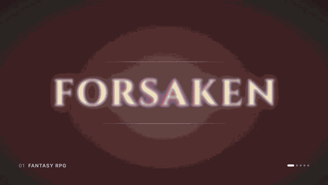
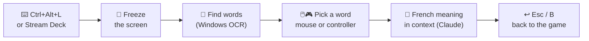

# 📖 InstructMe

**Understand any English word in your game, without leaving the game.**

Press a shortcut. The screen freezes. Click a word. A glass card tells you what it means in French, *in this sentence*.

<p align="center">
  <a href="docs/showreel.mp4">
    
  </a>
  <br>
  <sub>🎬 <b>15-second showreel.</b> <a href="docs/showreel.mp4">Watch it in HD with sound</a> · made in code with <a href="showreel/">Remotion</a></sub>
</p>

---

## ✨ How it works



| | What you get |
|---|---|
| 🧊 **Frozen capture** | Words do not move while you read. |
| 🎯 **Word or phrase** | Pick one word, or grow the selection for phrases like *give up*. |
| 🇫🇷 **Meaning in context** | Not a dictionary list: the meaning *in this game sentence*. |
| 🔊 **Listen** | Hear the word or the full game sentence with a natural neural voice. |
| 🪟 **Liquid Glass look** | Translucent, blurred panels. The game stays visible. |

---

## 🚀 Quick start

**You need:** Windows 10 (2004+) or 11, the [.NET 10 SDK](https://dotnet.microsoft.com/download), and a [Claude API key](https://console.anthropic.com/).

1. Give the app your API key (once):

   ```bash
   setx ANTHROPIC_API_KEY "sk-ant-..."
   ```

2. Start the app:

   ```bash
   dotnet run --project src/InstructMe
   ```

   An ℹ️ icon appears in the system tray.

3. In your game, press **Ctrl + Alt + L**.

> 💡 **Tip:** Play in **borderless window** mode. Exclusive fullscreen can minimize the game when the overlay opens.

---

## 🎮 Controls

| Action | 🖱️ Mouse / ⌨️ Keyboard | 🎮 Controller (Xbox layout) |
|---|---|---|
| Open / close the overlay | `Ctrl+Alt+L` | — (use the shortcut or Stream Deck) |
| Move between words | Arrow keys | D-pad or left stick |
| Show the meaning | Click the word · `Enter` | **A** |
| Add the next word (phrase) | `Shift`+click · `Shift+→` | **RB** |
| Remove the last word | `Shift+←` | **LB** |
| 🔊 Hear the word | 🔊 button · `P` | **Y** |
| 🔊 Hear the sentence | **Écouter la phrase** · `Shift+P` | **X** |
| Back to the game | `Esc` | **B** |

### 🎛️ Stream Deck

Add a **Hotkey** action and set it to `Ctrl+Alt+L`. The same button opens and closes the overlay.

---

## ⚙️ Settings

The first run creates `%APPDATA%\InstructMe\settings.json`. Right-click the tray icon → **Ouvrir les réglages**.

```json
{
  "hotkey": "Ctrl+Alt+L",
  "model": "claude-haiku-4-5",
  "voice": "en-US-EmmaMultilingualNeural",
  "anthropicApiKey": null
}
```

| Key | Meaning |
|---|---|
| `hotkey` | Any `Ctrl` / `Alt` / `Shift` / `Win` + key, e.g. `Ctrl+Shift+F9`. Restart the app after a change. |
| `model` | Claude model for the definitions. Haiku is fast and cheap. |
| `voice` | Free Microsoft neural voice, e.g. `en-US-AndrewMultilingualNeural` or `en-GB-SoniaNeural`. Empty `""` = Windows voices only. |
| `anthropicApiKey` | Only if you do not use the `ANTHROPIC_API_KEY` variable. |

Errors are written to `%APPDATA%\InstructMe\error.log`.

---

## 🧩 Known limits (V1)

| ⚠️ Limit | Why |
|---|---|
| The game may still react to your controller | Many games read the gamepad in the background. Test your game; pause it if needed. |
| Exclusive fullscreen | The overlay takes focus. Some games minimize. Use borderless mode. |
| Stylized fonts | Windows OCR reads clean UI text best. Decorative fonts can fail. |
| Xbox-compatible controllers only | Input uses XInput. PlayStation pads work through Steam Input or DS4Windows. |
| Online only for meanings | The selected words and their sentence are sent to the Claude API. The screenshot is not sent. |
| HDR screens | Captures can look washed out. |
| Neural voice needs internet | It uses the free, unofficial Edge "Read aloud" service. Microsoft can change it. Offline, the app falls back to an installed English Windows voice (Settings → Time & language → Speech). |

---

## 🛠️ For developers

```
src/InstructMe/
├── App.xaml.cs            background app, tray icon, shortcut → capture → overlay
├── Capture/               Windows Graphics Capture, GDI fallback
├── Text/                  OCR, line merging, sentence blocks, word navigation
├── Input/                 global shortcut, XInput polling, gamepad → actions
├── Definitions/           Claude request (structured JSON), text-to-speech
└── Overlay/               full-screen window, glass panels, card placement
tests/InstructMe.Tests/    layout, navigation, input, and placement tests
```

Run the tests:

```bash
dotnet test
```

---

## 🤝 Contributing

Ideas, bug reports, and pull requests are welcome.

| 📄 Read | 🎯 For |
|---|---|
| [CONTRIBUTING.md](CONTRIBUTING.md) | How to set up, test, commit, and open a pull request. |
| [AI_GUIDELINES.md](AI_GUIDELINES.md) | Rules when an AI tool helps you write code. |
| [AGENTS.md](AGENTS.md) | Instructions that AI coding agents read in this repo. |
