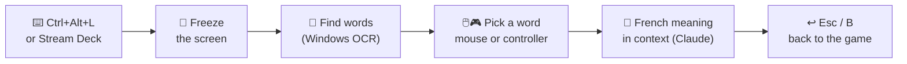
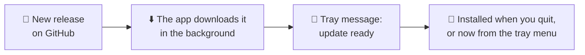

# 📖 InstructMe

[](https://github.com/SofianeBel/InstructMe/actions/workflows/ci.yml)
[](https://github.com/SofianeBel/InstructMe/releases/latest)
[](LICENSE)

**Understand any English word in your game, without leaving the game.**

Press a shortcut. The screen freezes. Click a word. A glass card tells you what it means in French, *in this sentence*.

<p align="center">
  <a href="docs/showreel.mp4">
    
  </a>
  <br>
  <sub>🎬 <b>15-second showreel.</b> <a href="docs/showreel.mp4">Watch it in HD with sound</a> · made in code with <a href="showreel/">Remotion</a></sub>
</p>

---

## ✨ How it works



| | What you get |
|---|---|
| 🧊 **Frozen capture** | Words do not move while you read. |
| 🎯 **Word or phrase** | Pick one word, or grow the selection for phrases like *give up*. |
| 🇫🇷 **Meaning in context** | Not a dictionary list: the meaning *in this game sentence*. |
| 🔊 **Listen** | Hear the word or the full game sentence with a natural neural voice. |
| 🔎 **Recover missed text** | Re-scan a smaller area, or correct the word and its sentence before looking it up. |
| 📖 **Keep your vocabulary** | Successful translations are saved automatically, with their game sentence, for later review. |
| 🪟 **Liquid Glass look** | Translucent, blurred panels. The game stays visible. |

---

## 🚀 Quick start

**You need:** Windows 10 (2004+) or 11 and a [Claude API key](https://console.anthropic.com/).

1. ⬇️ **[Download the installer](https://github.com/SofianeBel/InstructMe/releases/latest/download/InstructMe-win-Setup.exe)** and open it. It installs in one click, for your Windows account only: no admin rights, no questions, and no .NET to install.

   > 🛡️ The installer is not code-signed. If Windows SmartScreen stops it, click **More info → Run anyway**.

2. Give the app your API key (once):

   ```bash
   setx ANTHROPIC_API_KEY "sk-ant-..."
   ```

3. InstructMe starts by itself after the install, and then each time you sign in to Windows. An ℹ️ icon appears in the system tray. You can also find it in the Start menu and on the desktop.

4. In your game, press **Ctrl + Alt + L**.

> 🎒 **No install?** Take `InstructMe-win-Portable.zip` from the [latest release](https://github.com/SofianeBel/InstructMe/releases/latest), unzip it anywhere, and start `InstructMe.exe`.

> 🧑‍💻 **From the source code:** install the [.NET 10 SDK](https://dotnet.microsoft.com/download), then run `dotnet run --project src/InstructMe`.

> 💡 **Tip:** Play in **borderless window** mode. Exclusive fullscreen can minimize the game when the overlay opens.

---

## 🔄 Updates



- The installed app looks for a new version 30 seconds after it starts, then every 6 hours. Only the changed files are downloaded.
- To install it now, right-click the tray icon → **Installer la version … et redémarrer**. Otherwise, it installs when you quit InstructMe.
- Your settings, API key, and vocabulary stay in `%APPDATA%\InstructMe`. Updates and uninstalls never touch this folder.
- To uninstall: **Windows Settings → Apps → InstructMe → Uninstall**.

### 📦 You have an old `InstructMe.exe` (before the installer)

The old single-file version cannot update itself. Move to the installer once:

1. Right-click the old tray icon → **Quitter**.
2. Run the [installer](https://github.com/SofianeBel/InstructMe/releases/latest/download/InstructMe-win-Setup.exe).
3. Delete the old `InstructMe.exe`.

Your settings and vocabulary are kept: the new version reads the same folder. From now on, updates are automatic.

---

## 🎮 Controls

| Action | 🖱️ Mouse / ⌨️ Keyboard | 🎮 Controller (Xbox layout) |
|---|---|---|
| Open / close the overlay | `Ctrl+Alt+L` | — (use the shortcut or Stream Deck) |
| Move between words | Arrow keys | D-pad or left stick |
| Show the meaning | Click the word · `Enter` | **A** |
| Add the next word (phrase) | `Shift`+click · `Shift+→` | **RB** |
| Remove the last word | `Shift+←` | **LB** |
| 🔊 Hear the word | 🔊 button · `P` | **Y** |
| 🔊 Hear the sentence | **Écouter la phrase** · `Shift+P` | **X** |
| Re-scan an area | **Relire une zone** · `R`, then drag a rectangle | — |
| Correct or type a word and its context | **Saisir / corriger** · `E`; `Ctrl+Enter` to explain | — |
| Retry a failed lookup | **Réessayer** · `F5` | **A** |
| Open your vocabulary | **Mon vocabulaire** · `H` | — |
| Back to the game | `Esc` | **B** |

### 🎛️ Stream Deck

Add a **Hotkey** action and set it to `Ctrl+Alt+L`. The same button opens and closes the overlay.

### 🔎 When OCR misses a word

Choose **Relire une zone** and draw around the subtitles or dialogue. OCR reads that area at a larger scale and replaces the selectable words with the new result. **Tout l’écran** restores full-screen detection. `Esc` / **B** cancels area selection.

Choose **Saisir / corriger** to edit the selected expression and its game sentence. You can also type them when no text was detected. The app uses that corrected context for the meaning and pronunciation.

### 📖 Your vocabulary between sessions

Open **Mon vocabulaire** from the tray menu or the overlay. Search by English expression, French translation, or game sentence, and switch between **Toutes les sessions** and **Cette session**. A session starts when the app launches. Each successful lookup is saved locally in `%APPDATA%\InstructMe\vocabulary.json`; repeats update the same entry when the expression, context, and model match.

Previously saved meanings can be reused without a network request, including after restarting the app. New meanings need an internet connection. A lookup has a 20-second overall limit and a **Réessayer** action when it fails.

You can also launch `InstructMe.exe --vocabulary` to open the vocabulary window directly.

---

## ⚙️ Settings

The first run creates `%APPDATA%\InstructMe\settings.json`. Right-click the tray icon → **Ouvrir les réglages**.

```json
{
  "hotkey": "Ctrl+Alt+L",
  "model": "claude-haiku-4-5",
  "voice": "en-US-EmmaMultilingualNeural",
  "launchAtStartup": true,
  "anthropicApiKey": null
}
```

| Key | Meaning |
|---|---|
| `hotkey` | Any `Ctrl` / `Alt` / `Shift` / `Win` + key, e.g. `Ctrl+Shift+F9`. Changes saved in the settings window apply immediately; restart after editing the file directly. |
| `model` | Claude model for the definitions. Haiku is fast and cheap. |
| `voice` | Free Microsoft neural voice, e.g. `en-US-AndrewMultilingualNeural` or `en-GB-SoniaNeural`. Empty `""` = Windows voices only. |
| `launchAtStartup` | `true` (default) starts InstructMe in the tray when you sign in to Windows. Toggle it with **Lancer avec Windows** in the settings window. |
| `anthropicApiKey` | The key entered in settings takes priority. If empty, the app uses `ANTHROPIC_API_KEY`. |

Errors are written to `%APPDATA%\InstructMe\error.log`.

---

## 🧩 Known limits (V1)

| ⚠️ Limit | Why |
|---|---|
| The game may still react to your controller | Many games read the gamepad in the background. Test your game; pause it if needed. |
| Exclusive fullscreen | The overlay takes focus. Some games minimize. Use borderless mode. |
| Stylized fonts | Windows OCR reads clean UI text best. Decorative fonts can fail. |
| Xbox-compatible controllers only | Input uses XInput. PlayStation pads work through Steam Input or DS4Windows. |
| New meanings need internet | The selected words and their sentence are sent to the Claude API. The screenshot is not sent. Previously saved meanings remain available locally for the same context and model. |
| HDR screens | Captures can look washed out. |
| Neural voice needs internet | It uses the free, unofficial Edge "Read aloud" service. Microsoft can change it. Offline, the app falls back to an installed English Windows voice (Settings → Time & language → Speech). |

---

## 🛠️ For developers

```
src/InstructMe/
├── App.xaml.cs            background app, tray icon, shortcut → capture → overlay
├── Capture/               Windows Graphics Capture, GDI fallback
├── Text/                  OCR, line merging, sentence blocks, word navigation
├── Input/                 global shortcut, XInput polling, gamepad → actions
├── Definitions/           Claude request (structured JSON), text-to-speech
├── Vocabulary/            persistent translations, session filtering, review window
└── Overlay/               full-screen window, glass panels, card placement
tests/InstructMe.Tests/    layout, navigation, input, and placement tests
```

Run the tests:

```bash
dotnet test
```

---

## 🤝 Contributing

Ideas, bug reports, and pull requests are welcome.

| 📄 Read | 🎯 For |
|---|---|
| [CONTRIBUTING.md](CONTRIBUTING.md) | How to set up, test, commit, and open a pull request. |
| [AI_GUIDELINES.md](AI_GUIDELINES.md) | Rules when an AI tool helps you write code. |
| [AGENTS.md](AGENTS.md) | Instructions that AI coding agents read in this repo. |

---

## 📜 License

InstructMe is free software under the [GNU GPL v3.0 or later](LICENSE).

| ✅ You can | 📌 If you share it, you must |
|---|---|
| Use it, study it, change it, and share it. Also for commercial use. | Keep it under the GPL, share the source code, and keep the copyright and license notices. |
