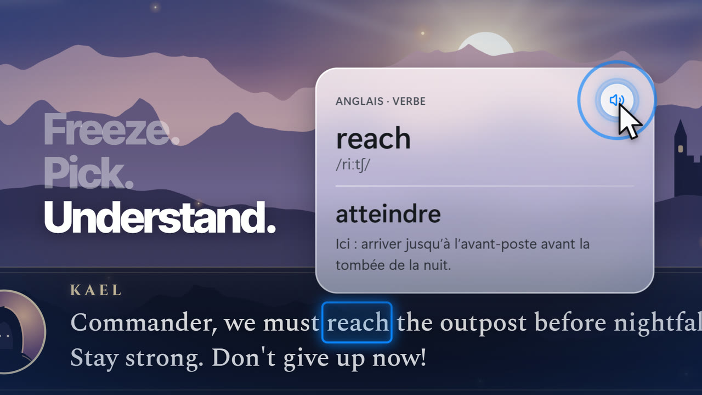
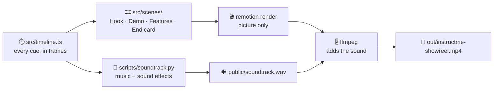

<div align="center">



# 🎬 InstructMe · Showreel

**A 15-second ad that shows what InstructMe does.**<br>
Everything is made in code: the picture with [Remotion](https://www.remotion.dev) (React), and the music and sound effects with a Python script.

`1920 × 1080` · `60 fps` · `15 s` · `H.264 + AAC`

</div>

---

## 🍿 The story in 15 seconds

| ⏱️ Time | 🎞️ Scene | 👀 What you see |
| :-- | :-- | :-- |
| **0 – 2 s** | Hook | Five game genres flash by. Then: *"Stuck on a word?"* |
| **2 – 10.5 s** | Demo | The player presses <kbd>Ctrl</kbd> + <kbd>Alt</kbd> + <kbd>L</kbd>. The game freezes. OCR finds the words.<br>A click on **reach** opens a glass card: *atteindre*. The speaker button says the word.<br>A controller moves to **give** and grows the selection to **give up**: *abandonner*. <kbd>B</kbd> goes back to the game. |
| **10.5 – 12 s** | Features | Six features pop in around the game screen. |
| **12 – 15 s** | End card | The logo lands. *"Every word. Understood."* turns into *"Chaque mot. Compris."* |

## ▶️ Quick start

**You need:** Node 22 or later · [ffmpeg](https://ffmpeg.org) · Python 3 with `numpy` and `scipy` (only to make the soundtrack again).

**1. Install**

```bash
npm install
```

**2. Preview.** Remotion Studio opens in your browser. You can play and scrub the video there.

```bash
npm run dev
```

**3. Render the video** (about 1–2 minutes). The result is `out/instructme-showreel.mp4`.

```bash
npm run render
```

> [!NOTE]
> Use `npm run render`, not a plain `npx remotion render`. Remotion renders the picture, then ffmpeg adds the sound.
> A plain Remotion render plays the sound about 43 ms late, because the AAC encoder delay stays in the file.

**4. Make the soundtrack again.** Do this after you change the timing.

```bash
npm run soundtrack
```

## 🧭 How it fits together



> [!TIP]
> To change the timing, edit only `src/timeline.ts`. Then run `npm run soundtrack`, so the sound follows the picture.

## 🗂️ Where things are

| 📁 Folder | 📦 What is inside |
| :-- | :-- |
| `src/scenes/` | The four scenes |
| `src/game/` | The game in the video: landscape, HUD, dialog box |
| `src/components/` | Liquid Glass, definition card, keycaps, cursor, controller, captions |
| `src/lib/` | Animation helpers, noise, and the word boxes (the "OCR") |
| `scripts/` | The soundtrack generator |
| `public/` | The soundtrack and the voice clip |

## 📝 Good to know

- 🎮 **The game is not real.** It is drawn in SVG and HTML for this video.
- 🔍 **The word boxes are measured, not guessed.** The browser measures each word, like Windows OCR does on a real screen.
- 📐 **The card follows the app's rules.** Same selection padding, same place above the text, same distance from the word.
- 🗣️ **The voice** that says "reach" is a Windows text-to-speech voice.
- ⚖️ **License.** Some companies need a Remotion company license. [Read the terms](https://github.com/remotion-dev/remotion/blob/main/LICENSE.md).
